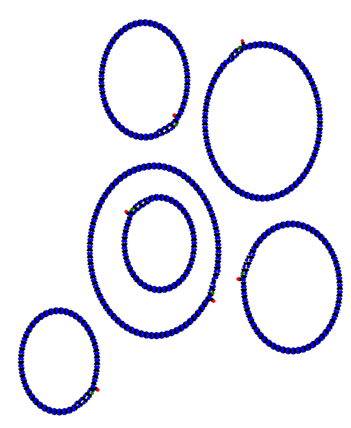
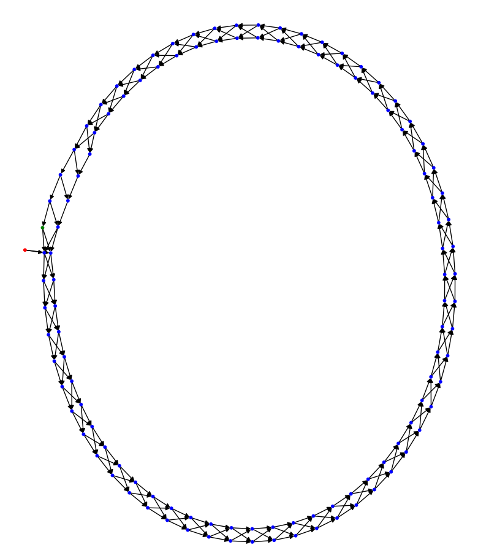

# README

## Installation

For the python script, you have to install graphviz. For graphviz, you have to run the following script after
installation:

```pwsh
python -m pip install --use-pep517 `
              --config-setting='--global-option=build_ext' `
              --config-setting='--global-option="-IC:\Program Files\Graphviz\include"' `
              --config-setting='--global-option="-LC:\Program Files\Graphviz\lib"' `
              pygraphviz
``` 

## Why does LCM work?

I am trying to learn why LCM worked for the programming solution. I am not sure where the intuition that LCM
would work came from to begin with.

We generated the following graph using this python code:
```python 
import networkx as nx
import matplotlib.pyplot as plt

def plot_graph(G: nx.DiGraph):

    color_map = []
    for node in G:
        if node.__contains__("A"):
            color_map.append('red')
        elif node.__contains__("Z"):
            color_map.append('green')
        else:
            color_map.append('blue') 
    
    subax1 = plt.subplot(121)
    pos = nx.nx_agraph.graphviz_layout(G, prog='neato')
    nx.draw_networkx_nodes(G, pos, node_size=10, node_color=color_map)
    nx.draw_networkx_edges(G, pos, arrows=True)
    plt.show()

# open input file
# 8 starting locations that have A
with open('input.txt', encoding="utf-8") as f:
    instructions = f.readline()

    print("Instructions:", instructions)

    f.readline() # skip first two lines

    G = nx.DiGraph()

    # create graph
    for line in f:
        split = line.split('=')
        node = split[0].strip()
        right = split[1].strip()

        for child in right.split(", "):
            G.add_node(node)

            child_node = child.replace("(", ""). replace(")", "").strip()

            G.add_node(child_node)
            G.add_edge(node, child_node)       

    plot_subpaths(G)
    plot_graph(G)
```



If we zoom in on one of these cycles, we see the following:


We can see that the cycle contains one starting location in green that is outside of the loop, and one ending
location that is within the loop. We can also see that on each iteration, you end up on the same 'slice' of the
circle, as each node comes in pairs. I am not sure if this means that for each cycle, there is a 50% chance that 
we land on the target node, or if it says anything at all about how often we hit the target node. That will come
with some further analysis.

### Are the cycles evenly spaced?

Next we find out that all the cycles are evenly spaced. We did this by running the simulation per slice,
calculating the diffs, and checking if they are all equal.

We get the following results by starting location:
```
BBA
Hits are evenly spaced by 21409
BLA
Hits are evenly spaced by 11653
AAA
Hits are evenly spaced by 19241
NFA
Hits are evenly spaced by 12737
DRA
Hits are evenly spaced by 14363
PSA
Hits are evenly spaced by 15989
```

Since all the cycles are evenly spaced exactly, including the starting location, we can find the LCM of all those values to find the answer.

LCM(21409, 11653, 19241, 12737, 14363, 15989) = 9606140307013